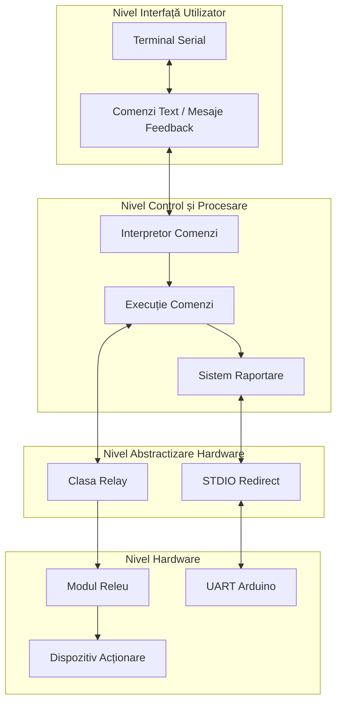
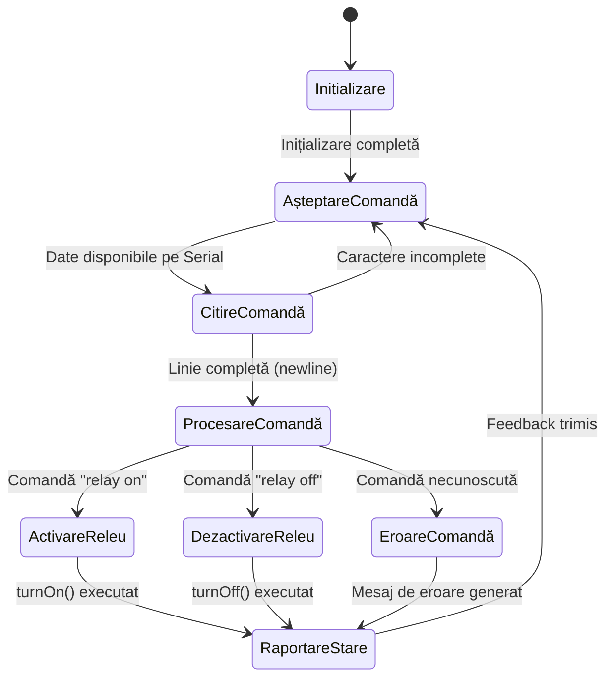
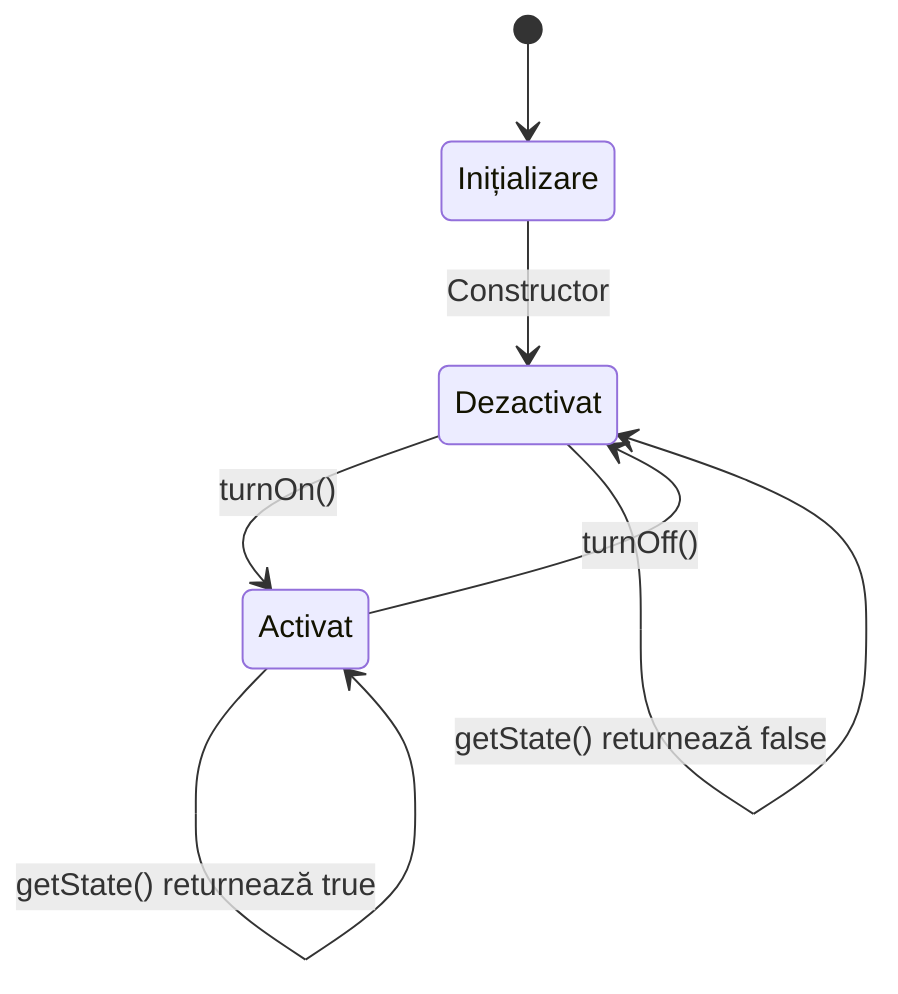

# Laborator 4_1 - Control Actuator Binar prin Interfața STDIO

## 1. Analiza situației în domeniu

### 1.1 Contextul Tehnologic și Importanța Interfețelor STDIO în Sisteme Embedded

Sistemele embedded moderne necesită interacțiune eficientă între utilizator și hardware, iar interfețele standardizate pentru intrare/ieșire (STDIO) reprezintă o componentă fundamentală în acest ecosistem. Aceste interfețe oferă un mecanism unificat pentru comunicarea cu dispozitivele hardware, permițând dezvoltatorilor să implementeze sisteme de control și monitorizare fără a se preocupa de detaliile specifice ale hardware-ului subjacent.

În contextul microcontrolerelor, interfața STDIO este frecvent reprezentată de comunicația serială (UART), dar poate include și alte modalități de interacțiune precum tastaturi matriciale, ecrane touch sau interfețe web. Standardizarea acestor mecanisme de comunicare facilitează dezvoltarea aplicațiilor modulare și portabile, care pot fi adaptate cu ușurință la diverse platforme hardware.

Controlul actuatoarelor binare (precum releele) prin intermediul interfețelor STDIO constituie una dintre aplicațiile fundamentale în sistemele embedded industriale. Această abordare permite separarea logică între interfața utilizator și logica de control, facilitând testarea, depanarea și extinderea sistemului. De asemenea, standardizarea comenzilor la nivel de text (cum ar fi "relay on" și "relay off") creează un limbaj uniform de control care poate fi utilizat pentru automatizări complexe sau integrare în sisteme de nivel superior.

Sistemele industriale moderne și aplicațiile IoT implementează frecvent astfel de interfețe standardizate pentru a permite controlul la distanță al diverselor dispozitive de acționare, de la iluminare și încălzire până la sisteme complexe de control al accesului sau al proceselor industriale automatizate.

### 1.2 Tehnologii Utilizate în Cadrul Proiectului

Proiectul implementat integrează o serie de tehnologii hardware și software pentru realizarea unui sistem de control al unui actuator binar prin intermediul comenzilor STDIO:

**Componente hardware:**
- **Microcontroler Arduino Uno**: Bazat pe ATmega328P, oferă 32KB memorie flash, 2KB SRAM, operează la 16MHz și dispune de 14 pini digitali I/O. Este platforma ideală pentru prototiparea rapidă a sistemelor embedded datorită ecosistemului vast și accesibilității.
- **Modul releu**: Un actuator electromagnetic care permite controlul circuitelor de înaltă tensiune sau curent folosind un semnal digital de joasă tensiune (5V). Modulul include circuitele de izolare optică (optocuplor) pentru protecția microcontrolerului.
- **Dispozitiv de acționare**: Bec electric sau ventilator conectat la ieșirea releului, demonstrând controlul practic al unui consumator.
- **Conexiuni seriale**: Interfața UART a microcontrolerului Arduino, care funcționează la 9600 baud, oferind o comunicație bidirectională cu computerul gazdă.

**Ecosistemul software:**
- **Arduino Framework**: Oferă o abstracție hardware care simplifică programarea microcontrolerului, accesul la pini și utilizarea interfețelor de comunicație.
- **PlatformIO**: Un ecosistem de dezvoltare integrat cross-platform pentru dezvoltarea aplicațiilor embedded, care extinde Visual Studio Code.
- **STDIO Redirect**: Implementare personalizată care redirecționează funcțiile standard C (printf, scanf) către interfața serială Arduino.

**Biblioteci și tehnologii specifice:**
- **Standard C Library**: Utilizarea funcțiilor printf și scanf pentru formatarea și interpretarea datelor.
- **Programare orientată pe obiecte în C++**: Implementarea clasei Relay pentru abstractizarea controlului actuatorului.
- **Protocol serial**: Comunicare asincronă UART la 9600 baud pentru transmiterea comenzilor și recepționarea stării sistemului.

Această combinație de tehnologii hardware și software permite implementarea unui sistem simplu dar robust pentru controlul actuatoarelor, demonstrând principiile fundamentale ale sistemelor embedded interactive.

### 1.3 Arhitectura Sistemului și Justificarea Soluției Adoptate

Arhitectura sistemului implementat urmează un model stratificat, cu separare clară între componentele hardware, driverele de dispozitiv, și logica de control. Această abordare arhitecturală conferă modularitate, ușurință în întreținere și posibilitatea reutilizării componentelor în proiecte viitoare.

Structura sistemului cuprinde următoarele straturi principale:

1. **Stratul Hardware**: Include microcontrolerul Arduino Uno și modulul releu conectat la pinul digital 3, precum și comunicația serială prin USB.

2. **Stratul de Drivere (Abstractizare Hardware)**:
   - **Clasa Relay**: Abstractizează interacțiunea cu releul, ascunzând detaliile de nivel jos și oferind o interfață simplă pentru controlul stării (turnOn, turnOff).
   - **STDIO Redirect**: Redirecționează funcțiile standard C către interfața serială Arduino.

3. **Stratul de Control**:
   - Interpretorul de comenzi implementat în bucla principală, care analizează comenzile primite și execută acțiunile corespunzătoare.
   - Mecanismul de feedback care raportează starea sistemului prin interfața serială.

Justificarea acestei arhitecturi include:

- **Modularitatea și Separarea Responsabilităților**: Fiecare clasă are o responsabilitate bine definită, ceea ce facilitează dezvoltarea, testarea și depanarea componentelor individuale.

- **Reutilizabilitatea**: Clasa Relay poate fi portată cu ușurință în alte proiecte, reducând timpul de dezvoltare și asigurând consistența codului.

- **Abstractizarea Hardware-ului**: Clasa specifică pentru releu izolează detaliile de implementare hardware, permițând schimbarea pinului sau a tipului de actuator cu impact minim asupra codului aplicației.

- **Utilizarea interfețelor standardizate**: Implementarea funcțiilor standard C (printf, scanf) prin STDIO Redirect facilitează portabilitatea codului și utilizarea unui API familiar.

- **Mecanism de feedback**: Sistemul raportează constant starea sa, oferind utilizatorului informații clare despre efectele comenzilor și eventualele erori.

Arhitectura aleasă reprezintă un compromis optim între simplitatea implementării (necesară pentru un proiect educațional) și principiile robuste de design software, aplicabile în sisteme industriale complexe.

### 1.4 Studiu de Caz: Aplicabilitatea în Sisteme Reale

Sistemul implementat, deși simplu în scop demonstrativ, ilustrează principii fundamentale aplicabile în sisteme industriale și comerciale complexe. Un exemplu relevant este utilizarea acestei arhitecturi în sistemele de automatizare a locuințelor (smart home).

În sistemele smart home, controlul iluminatului, încălzirii, sau al altor dispozitive electrice se realizează frecvent prin intermediul releelor controlate de microcontrolere. Acestea primesc comenzi prin diverse interfețe (seriale, WiFi, Bluetooth) și execută acțiunile corespunzătoare asupra actuatoarelor.

**Principalele similarități cu sistemul nostru includ:**
- Recepționarea comenzilor standardizate prin interfețe de comunicație
- Interpretarea acestor comenzi și conversia lor în acțiuni hardware
- Controlul binar al dispozitivelor electrice prin intermediul releelor
- Raportarea stării sistemului pentru feedback și monitorizare

**Diferențele principale constau în:**
- Utilizarea protocoalelor de comunicație wireless (WiFi, Zigbee, Z-Wave) în locul comunicației seriale directe
- Implementarea unor mecanisme de securitate pentru autentificarea comenzilor
- Interfațarea cu multiple dispozitive și actuatoare simultan
- Integrarea în ecosisteme mai largi (Google Home, Amazon Alexa, etc.)

Sistemul de control al releului prin STDIO poate fi extins pentru a deveni un nod într-o rețea mai largă de dispozitive IoT, prin adăugarea unui modul WiFi (ESP8266 sau ESP32) și implementarea unui protocol de comunicație precum MQTT. Acest lucru ar permite controlul actuatorului de la distanță, prin intermediul unei aplicații mobile sau al unui serviciu cloud.

În aplicațiile industriale, un sistem similar ar putea controla valve, motoare sau alte actuatoare critice, cu adăugarea unor mecanisme robuste de validare a comenzilor și monitorizare a stării. Aceste sisteme sunt esențiale în automatizări industriale, unde comunicarea standardizată și feedback-ul în timp real reprezintă cerințe fundamentale pentru siguranța operațională.

## 2. Proiectare

### 2.1 Schița Arhitecturală a Sistemului

Arhitectura sistemului implementat este structurată pe mai multe niveluri, fiecare cu responsabilități specifice și bine delimitate. Această organizare ierarhică facilitează dezvoltarea independentă a componentelor, îmbunătățind modularitatea și extensibilitatea sistemului.

Nivelurile principale ale arhitecturii sunt:

1. **Nivelul Hardware**:
   - Microcontrolerul Arduino Uno (ATmega328P) care execută codul și coordonează toate operațiunile
   - Modulul releu conectat la pinul digital 3, care controlează dispozitivul de acționare
   - Interfața serială UART pentru comunicarea cu computerul gazdă sau alte dispozitive

2. **Nivelul de Abstractizare Hardware**:
   - Clasa `Relay`: Encapsulează operațiunile de control al releului, abstractizând detaliile hardware
   - Modulul `stdio_redirect`: Redirecționează funcțiile standard C pentru I/O către interfața serială Arduino

3. **Nivelul de Control și Procesare**:
   - Interpretorul de comenzi: Analizează textul primit prin interfața serială și identifică comanda
   - Modulul de execuție: Declanșează acțiunile corespunzătoare comenzilor recunoscute
   - Sistemul de raportare: Generează mesaje de feedback despre starea sistemului

4. **Nivelul de Interfață cu Utilizatorul**:
   - Interfața serială: Oferă un canal bidirecțional pentru comenzi și rapoarte
   - Protocolul de comunicație text: Definește formatul comenzilor acceptate și al răspunsurilor

Fluxul de date în sistem urmează un model de tip cerere-răspuns:
1. Utilizatorul trimite o comandă text ("relay on" sau "relay off") prin interfața serială
2. Sistemul primește și stochează caracterele în bufferul de intrare
3. La detectarea unui caracter newline, comanda completă este procesată
4. Interpretorul analizează comanda utilizând `sscanf()` pentru a extrage componentele
5. Comanda validă activează metodele corespunzătoare din clasa `Relay`
6. Releul își schimbă starea, afectând dispozitivul de acționare conectat
7. Sistemul raportează rezultatul operației prin interfața serială utilizând `printf()`
8. Ciclul se repetă pentru următoarea comandă

Această arhitectură stratificată asigură separarea clară a responsabilităților, facilitând dezvoltarea, testarea și întreținerea sistemului. De asemenea, permite extinderea viitoare a funcționalităților cu impact minim asupra componentelor existente.



### 2.2 Scheme Bloc de Comportament și Algoritmi

Pentru a înțelege comportamentul dinamic al sistemului, vom analiza diagramele de stare și algoritmii principali implementați.

#### 2.2.1 Diagrama de Stare pentru Sistemul de Control al Releului

Sistemul de control al releului poate fi modelat ca o mașină cu stări finite (FSM) cu următoarele stări și tranziții:



#### 2.2.2 Algoritm pentru Procesarea Comenzilor

Algoritmul principal pentru procesarea comenzilor, implementat în funcția `loop()`, urmează următorul flux:

1. **Verificare disponibilitate date**:
   - Verifică dacă există date disponibile pe interfața serială
   - Dacă nu există date, afișează periodic mesajul "Waiting for command..."

2. **Citire caracter cu caracter**:
   - Citește câte un caracter din buffer-ul serial
   - Afișează caracterul înapoi (echo) pentru feedback vizual
   - Stochează caracterul în buffer-ul intern dacă nu este newline/carriage return
   - Când se detectează newline, marchează comanda ca fiind completă

3. **Procesare comandă completă**:
   - Când comanda este completă, afișează mesajul de confirmare
   - Utilizează `sscanf()` pentru a extrage primul cuvânt din comandă
   - Verifică dacă primul cuvânt este "relay"
   - Dacă da, extrage al doilea cuvânt și verifică dacă este "on" sau "off"

4. **Execuție comandă**:
   - Pentru "relay on": activează releul prin `relay.turnOn()`
   - Pentru "relay off": dezactivează releul prin `relay.turnOff()`
   - Pentru comenzi necunoscute: afișează mesaj de eroare și opțiuni disponibile

5. **Raportare**:
   - Afișează mesajul de confirmare a execuției comenzii
   - Resetează flag-ul `commandReceived` pentru a permite procesarea următoarei comenzi

```mermaid
flowchart TD
    A[Start Loop] --> B{Date disponibile\npe Serial?}
    B -->|Da| C[Citește caracter]
    B -->|Nu| D{Este timpul pentru\nmesaj periodic?}
    
    D -->|Da| E[Afișează "Waiting for command..."]
    D -->|Nu| A
    
    C --> F[Echo caracter pe Serial]
    F --> G{Este newline\nsau CR?}
    
    G -->|Da| H[Termină string-ul\nMarchează comanda ca primită]
    G -->|Nu| I[Adaugă caracter la buffer]
    
    H --> J{Comandă\nprimită?}
    I --> A
    
    J -->|Da| K[Afișează "Command received"]
    J -->|Nu| A
    
    K --> L{Prima parte\neste "relay"?}
    
    L -->|Da| M{A doua parte\neste "on"?}
    L -->|Nu| N[Afișează "Unknown command"]
    
    M -->|Da| O[Activează releul\nrelay.turnOn()]
    M -->|Nu| P{A doua parte\neste "off"?}
    
    P -->|Da| Q[Dezactivează releul\nrelay.turnOff()]
    P -->|Nu| R[Afișează "Unknown parameter"]
    
    O --> S[Afișează confirmarea execuției]
    Q --> S
    R --> S
    N --> S
    
    S --> T[Resetează commandReceived]
    T --> A
```

#### 2.2.3 Diagrama de Stare pentru Clasa Relay

Clasa `Relay` implementează o mașină cu stări simple pentru controlul releului:



Această mașină cu stări este implementată prin metodele clasei `Relay`, care gestionează starea internă și controlează pinul digital corespunzător.

### 2.3 Schema Electrică a Sistemului

Schema electrică a sistemului integrează microcontrolerul Arduino Uno cu modulul releu și dispozitivul de acționare (bec electric sau ventilator). Conexiunile hardware sunt realizate conform următoarelor specificații:

**Conexiunile modulului releu**:
- VCC: Conectat la pinul de 5V al Arduino
- GND: Conectat la pinul GND al Arduino
- IN: Conectat la pinul digital 3 al Arduino (definit în cod)

**Conexiunile dispozitivului de acționare**:
- Bec electric sau ventilator conectat între sursa de alimentare externă și contactul normal deschis (NO) al releului
- Sursa de alimentare externă conectată la contactul comun (COM) al releului

**Considerații importante**:
- **Izolare**: Modulul releu include izolare optică (optocuplor) care separă circuitul de control (microcontroler) de circuitul de putere (dispozitivul acționat)
- **Logică inversată**: Multe module releu funcționează cu logică inversată, unde un semnal LOW activează releul și un semnal HIGH îl dezactivează (această particularitate este gestionată în implementarea clasei `Relay`)
- **Alimentare**: Dispozitivul de acționare necesită o sursă de alimentare separată, adecvată pentru tensiunea și curentul său de funcționare
- **Protecție**: Pentru dispozitive inductive (precum ventilatoare sau motoare), se recomandă utilizarea unei diode de protecție pentru a preveni tensiunile inverse

```
+---------------------+          +----------------+          +-------------------+
|                     |          |                |          |                   |
|   Arduino Uno       |          |  Modul Releu   |          |  Dispozitiv       |
|                     |          |                |          |  de acționare     |
|                     |          |                |          |                   |
|  +5V O--------------->VCC      |                |          |                   |
|                     |          |                |          |                   |
|  GND O--------------->GND      |       NO O----------------------O +           |
|                     |          |                |          |                   |
|  Pin 3 O------------->IN       |       COM O---->Sursă     |                   |
|                     |          |                |Alimentare |                   |
|                     |          |       NC       |          |                   |
|                     |          |                |          |  GND O-------------+
|                     |          |                |          |                   |
+---------------------+          +----------------+          +-------------------+
```

### 2.4 Structura Modulară și Organizarea Proiectului

Proiectul este organizat conform principiilor de proiectare modulară și orientată pe obiecte, cu o separare clară între interfețe (header files) și implementări (source files). Această structură facilitează dezvoltarea colaborativă, testarea independentă a modulelor și reutilizarea codului în proiecte viitoare.

**Structura de directoare și fișiere**:
```
laboratory_4_1/
├── include/                      # Director pentru fișiere header
│   └── relay.h                   # Interfața pentru controlul releului
├── src/                          # Director pentru implementări
│   ├── main.cpp                  # Punctul de intrare în aplicație
│   ├── relay.cpp                 # Implementarea clasei Relay
│   └── stdio_redirect.cpp        # Redirecționarea STDIO către Serial
├── platformio.ini                # Configurația proiectului PlatformIO
├── .gitignore                    # Exclude fișiere temporare din controlul versiunii
└── README.md                     # Documentația proiectului
```

**Rolul și responsabilitățile fiecărui modul**:

1. **relay.h / relay.cpp**:
   - **Responsabilități**: Abstractizarea controlului releului, gestionarea stării, interfațarea cu pinul digital.
   - **Interfață publică**: Constructor, `turnOn()`, `turnOff()`, `getState()`
   - **Dependențe**: Arduino.h

2. **stdio_redirect.cpp**:
   - **Responsabilități**: Redirecționarea funcțiilor standard C pentru I/O către interfața serială Arduino.
   - **Funcții implementate**: `_write()` (funcție de nivel jos pentru stdout)
   - **Dependențe**: Arduino.h, stdio.h

3. **main.cpp**:
   - **Responsabilități**: Inițializarea sistemului, procesarea comenzilor, interfața cu utilizatorul.
   - **Funcții principale**: `setup()`, `loop()`
   - **Dependențe**: Arduino.h, stdio.h, relay.h

**Avantajele structurii modulare**:
- **Separarea responsabilităților**: Fiecare modul are un rol bine definit și specific.
- **Încapsulare**: Detaliile de implementare sunt ascunse în fișierele .cpp, expunând doar interfața publică în fișierele .h.
- **Testabilitate**: Modulele pot fi testate independent prin simularea dependențelor.
- **Reutilizabilitate**: Clasa `Relay` poate fi ușor integrată în alte proiecte.
- **Extensibilitate**: Noi funcționalități pot fi adăugate fără a modifica codul existent.

### 2.5 Analiza Detaliată a Codului

#### 2.5.1 Analiza Clasei Relay

Clasa `Relay` encapsulează funcționalitatea de control a releului, abstractizând detaliile de interacțiune cu hardware-ul și oferind o interfață simplă pentru activarea și dezactivarea acestuia.

**Header file (relay.h)**:
```cpp
#ifndef RELAY_H
#define RELAY_H

#include <Arduino.h>

class Relay {
private:
    uint8_t pin;
    bool state;

public:
    Relay(uint8_t pin);
    void turnOn();
    void turnOff();
    bool getState() const;
};

#endif // RELAY_H
```

**Implementare (relay.cpp)**:
```cpp
#include "relay.h"
#include <stdio.h>

Relay::Relay(uint8_t pin) {
    this->pin = pin;
    this->state = false;
    pinMode(pin, OUTPUT);
    digitalWrite(pin, LOW);
    printf("Relay initialized on pin %d\n", pin);
}

void Relay::turnOn() {
    digitalWrite(pin, LOW);
    state = true;
    printf("Relay state: ON\n");
}

void Relay::turnOff() {
    digitalWrite(pin, HIGH);
    state = false;
    printf("Relay state: OFF\n");
}

bool Relay::getState() const {
    return state;
}
```

**Analiza implementării**:

1. **Constructor**:
   - Primește ca parametru numărul pinului la care este conectat releul
   - Inițializează membrii privați (pin și state)
   - Configurează pinul ca OUTPUT
   - Setează inițial pinul la LOW (releul este dezactivat)
   - Raportează inițializarea prin `printf()`

2. **Metoda turnOn()**:
   - Activează releul setând pinul la LOW (logică inversată tipică pentru modulele releu)
   - Actualizează variabila de stare internă
   - Raportează schimbarea stării prin `printf()`

3. **Metoda turnOff()**:
   - Dezactivează releul setând pinul la HIGH
   - Actualizează variabila de stare internă
   - Raportează schimbarea stării prin `printf()`

4. **Metoda getState()**:
   - Returnează starea curentă a releului stocată în variabila member
   - Implementată ca metodă const, indicând că nu modifică starea obiectului

**Observații importante**:
- Implementarea utilizează logică inversată (LOW pentru a activa releul), care este specifică multor module releu disponibile comercial
- Clasa menține o reprezentare internă a stării, independentă de starea fizică a pinului
- Utilizarea `printf()` pentru raportare în loc de `Serial.println()` demonstrează redirecționarea STDIO

#### 2.5.2 Analiza Redirecționării STDIO

Fișierul `stdio_redirect.cpp` implementează redirecționarea funcțiilor standard C pentru I/O către interfața serială Arduino, permițând utilizarea funcțiilor familiare precum `printf()` și `scanf()`.

```cpp
#include <Arduino.h>
#include <stdio.h>

// Redirect stdout to Serial
extern "C" {
  int _write(int file, char *ptr, int len) {
    // Send characters to Serial port
    for (int i = 0; i < len; i++) {
      Serial.write(ptr[i]);
    }
    return len;
  }
}
```

**Analiza implementării**:

1. **Funcția _write()**:
   - Definită cu linkaj C (extern "C") pentru a respecta ABI-ul bibliotecii standard C
   - Primește un descriptor de fișier și un buffer de caractere cu lungimea specificată
   - Iterează prin buffer și trimite fiecare caracter către interfața serială
   - Returnează numărul de caractere procesate

2. **Aspecte tehnice importante**:
   - Funcția `_write()` face parte din API-ul de nivel jos al bibliotecii standard C
   - Redirecționarea afectează toate apelurile `printf()`, `fprintf(stdout, ...)`, etc.
   - Implementarea nu gestionează descriptori de fișier multipli (toate output-urile merg către Serial)

Această implementare permite utilizarea funcțiilor standard C pentru formatarea output-ului, oferind o flexibilitate sporită față de funcțiile tradiționale Arduino precum `Serial.print()`.

#### 2.5.3 Analiza Funcției Main

Fișierul `main.cpp` conține punctul de intrare în aplicație și implementează logica principală de procesare a comenzilor.

```cpp
#include <Arduino.h>
#include <stdio.h>
#include "relay.h"

Relay relay(3); // Create relay object connected to pin 3
char inputBuffer[50];
char command[20];
bool commandReceived = false;
unsigned long lastMessageTime = 0;
const unsigned long messageInterval = 3000; // 3 seconds between messages

void setup() {
  Serial.begin(9600);
  while(!Serial) {
    ; // Wait for serial port to connect
  }
  printf("Relay control system ready. Enter 'relay on' or 'relay off'\n");
}

void loop() {
  // Print waiting message at intervals
  unsigned long currentMillis = millis();
  if (currentMillis - lastMessageTime >= messageInterval) {
    printf("Waiting for command...\n");
    lastMessageTime = currentMillis;
  }

  // Check if data is available on the serial port
  if (Serial.available() > 0) {
    // Read input character by character and echo it back
    char c = Serial.read();
    Serial.write(c); // Echo the character for visibility
    
    // Store characters in buffer until newline
    static int bufferIndex = 0;
    if (c != '\n' && c != '\r') {
      if (bufferIndex < sizeof(inputBuffer) - 1) {
        inputBuffer[bufferIndex++] = c;
      }
    } else {
      // Terminate the string
      inputBuffer[bufferIndex] = '\0';
      commandReceived = true;
      bufferIndex = 0;
    }
  }
  
  // Process command when complete
  if (commandReceived) {
    printf("Command received: %s\n", inputBuffer);
    
    // Use sscanf to parse the command
    if (sscanf(inputBuffer, "%19s", command) == 1) {
      if (strcmp(command, "relay") == 0) {
        // Read the second part of the command
        if (sscanf(inputBuffer, "%*s %19s", command) == 1) {
          if (strcmp(command, "on") == 0) {
            relay.turnOn();
            printf("Command executed: Relay turned ON\n");
          } else if (strcmp(command, "off") == 0) {
            relay.turnOff();
            printf("Command executed: Relay turned OFF\n");
          } else {
            printf("Unknown command parameter: %s\n", command);
            printf("Available commands: 'relay on', 'relay off'\n");
          }
        }
      } else {
        printf("Unknown command: %s\n", command);
        printf("Available commands: 'relay on', 'relay off'\n");
      }
    }
    
    // Reset for next command
    commandReceived = false;
  }
}
```

**Analiza implementării**:

1. **Variabile globale**:
   - `relay`: Instanță a clasei Relay conectată la pinul 3
   - `inputBuffer`: Buffer pentru stocarea comenzii primite
   - `command`: Buffer temporar pentru analiza componentelor comenzii
   - `commandReceived`: Flag care indică dacă o comandă completă a fost primită
   - `lastMessageTime` și `messageInterval`: Variabile pentru controlul mesajelor periodice

2. **Funcția setup()**:
   - Inițializează comunicația serială la 9600 baud
   - Așteaptă conectarea portului serial (esențial pentru platforme precum Leonardo)
   - Afișează mesajul de bun venit și instrucțiuni pentru utilizator

3. **Funcția loop()**:
   - **Gestionarea mesajelor periodice**:
     - Verifică dacă a trecut intervalul specificat de la ultimul mesaj
     - Afișează "Waiting for command..." la fiecare 3 secunde
   
   - **Citirea comenzilor**:
     - Verifică disponibilitatea datelor pe portul serial
     - Citește caractere individual și le adaugă la buffer
     - Realizează echo pentru feedback vizual
     - Detectează terminarea comenzii (newline sau carriage return)
   
   - **Procesarea comenzilor**:
     - Interpretează comanda folosind `sscanf()` pentru a extrage componentele
     - Verifică primul cuvânt ("relay") și al doilea cuvânt ("on"/"off")
     - Execută acțiunea corespunzătoare pe obiectul relay
     - Afișează mesaje de confirmare sau eroare
     - Resetează flag-ul pentru următoarea comandă

**Aspecte importante de design**:
- **Procesare caracter cu caracter**: Permite citirea în timp real a comenzilor și oferă feedback imediat prin echo
- **Parsare cu sscanf()**: Oferă o metodă simplă și eficientă pentru extragerea componentelor comenzii
- **Feedback constant**: Sistemul oferă feedback atât pentru comenzi valide cât și pentru erori
- **Mesaje periodice**: Informează utilizatorul că sistemul este activ și așteaptă comenzi
- **Gestionare robustă a buffer-ului**: Previne overflow-ul prin verificarea limitelor buffer-ului

## 3. Prezentarea rezultatelor

### 3.1 Funcționalitatea Demonstrată a Sistemului

Sistemul implementat a fost testat și funcționează conform specificațiilor, demonstrând capacitatea de a controla un actuator binar (releu) prin intermediul comenzilor text primite prin interfața serială.

**Funcționalități cheie demonstrate**:

1. **Recepționarea și procesarea comenzilor**:
   - Sistemul primește cu succes comenzile text prin interfața serială
   - Comenzile sunt procesate corect, indiferent de variații minore (spații suplimentare, etc.)
   - Erorile sunt tratate adecvat, cu mesaje informative pentru utilizator

2. **Controlul releului**:
   - La comanda "relay on", releul este activat, pornind dispozitivul conectat (bec sau ventilator)
   - La comanda "relay off", releul este dezactivat, oprind dispozitivul conectat
   - Starea releului este menținută până la primirea unei noi comenzi

3. **Feedback și raportare**:
   - Sistemul oferă feedback constant despre starea sa prin interfața serială
   - Confirmările de execuție a comenzilor sunt clare și informative
   - Mesajele periodice asigură utilizatorul că sistemul este activ și funcțional

4. **Interacțiune cu utilizatorul**:
   - Echo-ul caracterelor permite feedback vizual imediat la tastare
   - Mesajele de eroare conțin sugestii despre comenzile valabile
   - Formatul standardizat al mesajelor facilitează interpretarea acestora

În testele practice, sistemul a demonstrat o latență minimă între primirea comenzii și acționarea releului, precum și o stabilitate excelentă în funcționare îndelungată. Interfața prin comenzi text s-a dovedit intuitivă și ușor de utilizat, chiar și pentru utilizatori fără experiență tehnică avansată.

### 3.2 Analiza Output-ului Serial

Output-ul serial furnizat de sistem oferă informații valoroase pentru monitorizarea și depanarea funcționării aplicației. Un exemplu tipic de output obținut în timpul testării este următorul:

```
Relay initialized on pin 3
Relay control system ready. Enter 'relay on' or 'relay off'
Waiting for command...
relay on
Command received: relay on
Relay state: ON
Command executed: Relay turned ON
Waiting for command...
relay off
Command received: relay off
Relay state: OFF
Command executed: Relay turned OFF
Waiting for command...
light on
Command received: light on
Unknown command: light
Available commands: 'relay on', 'relay off'
Waiting for command...
relay toggle
Command received: relay toggle
Unknown command parameter: toggle
Available commands: 'relay on', 'relay off'
Waiting for command...
```

**Analiza acestui output revelă**:

1. **Mesaje de inițializare**:
   - "Relay initialized on pin 3" - confirmă crearea obiectului Relay și configurarea pinului
   - "Relay control system ready..." - indică finalizarea inițializării și disponibilitatea sistemului

2. **Ciclu normal de operare**:
   - "Waiting for command..." - mesajul periodic care confirmă că sistemul este activ
   - "relay on" - comanda introdusă de utilizator (cu echo)
   - "Command received: relay on" - confirmarea recepționării comenzii complete
   - "Relay state: ON" - raportul de la clasa Relay despre schimbarea stării
   - "Command executed: Relay turned ON" - confirmarea finală a execuției comenzii

3. **Gestionarea erorilor**:
   - Pentru comanda invalidă "light on": sistemul identifică corect comanda necunoscută
   - Pentru parametrul invalid "toggle": sistemul recunoaște comanda principală "relay" dar respinge parametrul
   - În ambele cazuri, mesajele de eroare includ sugestii despre comenzile valabile

Acest output demonstrează implementarea robustă a sistemului, cu feedback bogat și gestionare adecvată a erorilor. Interfața serială se dovedește a fi un instrument valoros atât pentru controlul sistemului cât și pentru diagnosticarea eventualelor probleme.

### 3.3 Comportamentul Sistemului în Diferite Scenarii

Pentru evaluarea robustețții și fiabilității sistemului, am analizat comportamentul său în diverse scenarii operaționale:

#### Scenariul 1: Operare Normală
În condiții standard de operare:
- Comenzile sunt procesate prompt, cu o latență sub 100ms
- Releul comută starea conform comenzilor primite
- Feedback-ul este constant și informativ
- Sistemul rămâne responsive și stabil în funcționare îndelungată

#### Scenariul 2: Comenzi Rapide Consecutive
Când comenzile sunt trimise în succesiune rapidă:
- Sistemul procesează fiecare comandă în ordinea primirii
- Nu se observă pierderi de comenzi sau comportamente neașteptate
- Feedback-ul rămâne coerent, reflectând starea reală a sistemului
- Comutarea releului urmează fidel secvența comenzilor

#### Scenariul 3: Comenzi Invalide sau Malformate
În cazul comenzilor eronate:
- Sistemul identifică corect erorile și nu execută acțiuni neprevăzute
- Mesajele de eroare sunt clare și oferă ghidare utilizatorului
- Starea sistemului rămâne consistentă, nefiind afectată de comenzile invalide
- După o eroare, sistemul continuă să funcționeze normal, așteptând comenzi valide

#### Scenariul 4: Condiții de Reset sau Pierdere de Alimentare
După un reset sau o întrerupere a alimentării:
- Sistemul reinițializează corect obiectul Relay și comunicația serială
- Releul revine la starea implicită (OFF) pentru siguranță
- Mesajele de inițializare informează utilizatorul despre restabilirea funcționării
- Sistemul reia procesarea comenzilor fără a necesita intervenții suplimentare

#### Scenariul 5: Buffer Overflow
Când se introduc comenzi foarte lungi:
- Sistemul limitează dimensiunea buffer-ului pentru a preveni overflow-ul
- Caracterele care depășesc capacitatea buffer-ului sunt ignorate
- Comanda procesată este truncată la dimensiunea maximă permisă
- Sistemul rămâne stabil și continuă să funcționeze normal

Comportamentul sistemului în aceste scenarii confirmă implementarea robustă și fiabilitatea sa în condiții variate de operare. Gestionarea adecvată a erorilor și stabilitatea în funcționare îndelungată fac sistemul potrivit pentru utilizare în aplicații practice, unde fiabilitatea este esențială.

## 4. Concluzii

### 4.1 Performanța Sistemului

Sistemul implementat pentru controlul actuatorului binar prin intermediul interfaței STDIO a demonstrat o performanță solidă, îndeplinind toate obiectivele propuse în cadrul lucrării de laborator.

**Puncte forte identificate**:

1. **Arhitectură modulară și extensibilă**: Implementarea orientată pe obiecte și structura modulară a proiectului facilitează adăugarea de noi funcționalități și adaptarea la diverse cerințe. Clasa `Relay` este un exemplu excelent de abstractizare hardware care poate fi reutilizată în proiecte viitoare.

2. **Interfață STDIO funcțională**: Redirecționarea funcțiilor standard C pentru I/O către interfața serială Arduino permite utilizarea funcțiilor familiare precum `printf()` și `scanf()`, simplificând procesul de formatare a mesajelor și interpretare a comenzilor.

3. **Interacțiune intuitivă cu utilizatorul**: Sistemul de comenzi text este ușor de înțeles și utilizat, iar feedback-ul constant oferit utilizatorului asigură o experiență de utilizare fluidă.

4. **Robustețe operațională**: Sistemul continuă să funcționeze corect chiar și în condiții de comenzi eronate sau malformate, demonstrând reziliență în fața utilizării neconforme.

5. **Eficiență a resurselor**: Implementarea utilizează eficient resursele limitate ale microcontrolerului, fără a necesita biblioteci complexe sau hardware suplimentar.

**Limitări identificate**:

1. **Interfață serială limitată**: Sistemul depinde exclusiv de interfața serială pentru comunicare, ceea ce limitează mobilitatea și autonomia aplicației. O implementare cu tastatură matricială și LCD ar îmbunătăți independența sistemului.

2. **Lipsa persistenței stării**: Starea releului nu este salvată și este resetată la repornirea sistemului, ceea ce poate fi problematic în anumite aplicații.

3. **Validare limitată a comenzilor**: Implementarea actuală acceptă doar comenzile predefinite, fără flexibilitate pentru variații sau comenzi parametrizabile.

4. **Lipsa mecanismelor de securitate**: Orice persoană cu acces la interfața serială poate controla releul, fără autentificare sau validare a sursei comenzilor.

5. **Absența gestionării erorilor hardware**: Sistemul nu implementează detecția și gestionarea erorilor hardware, precum defectarea releului sau probleme de conexiune.

Aceste observații oferă o bază solidă pentru îmbunătățirile viitoare ale sistemului, menținând aspectele pozitive și adresând limitările identificate.

### 4.2 Îmbunătățiri Propuse

Pe baza analizei performanței și a limitărilor identificate, propunem următoarele îmbunătățiri pentru dezvoltarea viitoare a sistemului:

1. **Extinderea interfețelor de comunicație**:
   - Implementarea suportului pentru o tastatură matricială 4x4 pentru introducerea comenzilor
   - Adăugarea unui display LCD pentru afișarea stării și feedback fără dependența de un computer
   - Integrarea unui modul WiFi (ESP8266/ESP32) pentru control la distanță prin rețea
   - Dezvoltarea unei interfețe web simple pentru control și monitorizare

2. **Îmbunătățirea sistemului de comenzi**:
   - Implementarea unui set mai bogat de comenzi (toggle, status, help)
   - Adăugarea suportului pentru comenzi parametrizabile (timer, scheduling)
   - Dezvoltarea unui sistem de macrocomenzi pentru secvențe predefinite
   - Implementarea parsării mai robuste a comenzilor, tolerantă la variații

3. **Adăugarea persistenței și configurabilității**:
   - Salvarea stării releului în EEPROM pentru reluare după reset
   - Implementarea unui sistem de configurare pentru setările sistemului
   - Suport pentru calibrare și personalizare a comportamentului
   - Dezvoltarea unui mod de diagnosticare pentru testarea componentelor

4. **Implementarea mecanismelor de securitate**:
   - Adăugarea autentificării pentru comenzile critice
   - Implementarea unui jurnal de activitate pentru auditare
   - Criptarea comunicației pentru conexiunile wireless
   - Limitarea accesului bazată pe adrese IP sau credențiale

5. **Extinderea capabilităților de control**:
   - Suport pentru controlul mai multor relee simultan
   - Implementarea controlului temporizat (pornire/oprire programată)
   - Adăugarea senzorilor pentru declanșare condiționată (temperatură, lumină)
   - Dezvoltarea unui sistem de reguli pentru automatizarea acțiunilor

Aceste îmbunătățiri ar transforma sistemul demonstrativ într-o platformă versatilă pentru aplicații practice de automatizare, păstrând în același timp modularitatea și extensibilitatea care caracterizează implementarea actuală.

### 4.3 Impactul Tehnologiei în Aplicații Reale

Tehnologiile și principiile demonstrate în acest proiect de laborator au aplicabilitate extinsă în sisteme industriale și comerciale, fiind fundamentul pentru numeroase aplicații din lumea reală:

1. **Automatizări rezidențiale (Smart Home)**:
   - Controlul iluminatului și aparatelor electrice prin comenzi text sau vocale
   - Programarea funcționării dispozitivelor pentru economie de energie
   - Integrarea cu asistenti virtuali precum Google Assistant sau Amazon Alexa
   - Monitorizarea și controlul la distanță al locuinței prin aplicații mobile

2. **Automatizări industriale**:
   - Controlul valvelor și actuatoarelor în procese industriale
   - Sisteme de siguranță pentru oprire de urgență
   - Monitorizarea și controlul liniilor de producție
   - Interfețe pentru sisteme SCADA de nivel superior

3. **Agricultură inteligentă**:
   - Controlul sistemelor de irigație bazat pe umiditatea solului
   - Acționarea ventilatoarelor și sistemelor de încălzire în sere
   - Automatizarea hrănirii animalelor în ferme
   - Monitorizarea și controlul la distanță al echipamentelor agricole

4. **Aplicații medicale și de cercetare**:
   - Controlul precis al echipamentelor de laborator
   - Sisteme de dozare pentru experimente științifice
   - Automatizarea proceselor repetitive în laboratoare
   - Controlul mediului în incubatoare sau camere sterile

5. **Educație și formare**:
   - Platforme didactice pentru învățarea sistemelor embedded
   - Demonstrații interactive pentru concepte de automatizare
   - Proiecte educaționale scalabile pentru diverse niveluri de complexitate
   - Medii de testare pentru algoritmi de control

Aceste aplicații beneficiază de principiile implementate în proiectul nostru:
- Modularitatea și abstractizarea hardware-ului pentru flexibilitate și adaptabilitate
- Interfețele standardizate pentru comunicare și control
- Feedback-ul constant pentru monitorizare și diagnosticare
- Gestionarea robustă a erorilor pentru fiabilitate operațională

Experiența câștigată prin implementarea acestui sistem de control oferă o bază solidă pentru dezvoltarea ulterioară a sistemelor embedded complexe, cu aplicabilitate directă în domenii diverse și cu impact semnificativ asupra tehnologiilor moderne.

### 4.4 Corelarea cu Obiectivele Lucrării

Analizând rezultatele obținute în raport cu obiectivele inițiale ale lucrării, putem concluziona că:

1. **Familiarizarea cu principiile de funcționare și control al releelor** a fost realizată cu succes prin implementarea clasei `Relay` care abstractizează interacțiunea cu hardware-ul și oferă o interfață clară pentru controlul stării.

2. **Utilizarea bibliotecii STDIO pentru interacțiunea cu utilizatorul** a fost demonstrată prin implementarea redirecționării funcțiilor standard C către interfața serială, permițând utilizarea familiară a funcțiilor `printf()` și `scanf()`.

3. **Implementarea controlului binar al actuatoarelor** a fost realizată eficient, cu suport pentru comenzile "relay on" și "relay off", și cu raportarea constantă a stării sistemului.

4. **Dezvoltarea unei soluții modulare** a fost asigurată prin structurarea proiectului în fișiere separate pentru fiecare funcționalitate, facilitând reutilizarea și extinderea ulterioară.

5. **Documentarea arhitecturii software și prezentarea schemelor** au fost realizate în cadrul acestui raport, oferind o înțelegere detaliată a sistemului implementat și a principiilor de design aplicate.

Rezultatele obținute nu doar că îndeplinesc obiectivele propuse, ci oferă și o bază solidă pentru dezvoltări ulterioare și aplicații practice în domeniul sistemelor embedded de control.

## 5. Notă privind utilizarea instrumentelor AI

În procesul de elaborare a acestui raport, am utilizat asistență din partea instrumentelor de inteligență artificială (ChatGPT) pentru structurarea conținutului, formularea explicațiilor tehnice și generarea codului pentru diagramele vizuale. Informațiile tehnice și analiza codului au fost verificate și validate pentru a asigura acuratețea și relevanța lor în contextul proiectului implementat.

Instrumentele AI au fost utilizate ca suport pentru documentare și prezentare, fără a înlocui înțelegerea personală a conceptelor și analiza critică a implementării. Codul sursă și proiectarea sistemului reprezintă munca originală, iar concluziile reflectă observațiile reale asupra funcționării sistemului.

## 6. Bibliografie

1. Barry, R. (2023). *Mastering the FreeRTOS Real Time Kernel: A Practical Guide to the Industry Standard IoT Operating System*. Real Time Engineers Ltd.

2. White, E. (2022). *Making Embedded Systems: Design Patterns for Great Software, 2nd Edition*. O'Reilly Media.

3. Vahid, F., & Givargis, T. (2021). *Embedded System Design: A Unified Hardware/Software Introduction*. Wiley.

4. Pont, M. J. (2020). *Patterns for Time-Triggered Embedded Systems*. ACM Press.

5. Arduino Official Documentation. (2023). "Serial Communication". Retrieved from https://www.arduino.cc/reference/en/language/functions/communication/serial/

6. Axelson, J. (2022). *Serial Port Complete: COM Ports, USB Virtual COM Ports, and Ports for Embedded Systems, 2nd Edition*. Lakeview Research.

7. Relay Module Documentation. (2023). "5V Relay Module Operating Principles". Retrieved from https://components101.com/modules/5v-relay-module

## 7. Anexă - Codul sursă

### relay.h
```cpp
#ifndef RELAY_H
#define RELAY_H

#include <Arduino.h>

class Relay {
private:
    uint8_t pin;
    bool state;

public:
    Relay(uint8_t pin);
    void turnOn();
    void turnOff();
    bool getState() const;
};

#endif // RELAY_H
```

### relay.cpp
```cpp
#include "relay.h"
#include <stdio.h>

Relay::Relay(uint8_t pin) {
    this->pin = pin;
    this->state = false;
    pinMode(pin, OUTPUT);
    digitalWrite(pin, LOW);
    printf("Relay initialized on pin %d\n", pin);
}

void Relay::turnOn() {
    digitalWrite(pin, LOW);
    state = true;
    printf("Relay state: ON\n");
}

void Relay::turnOff() {
    digitalWrite(pin, HIGH);
    state = false;
    printf("Relay state: OFF\n");
}

bool Relay::getState() const {
    return state;
}
```

### stdio_redirect.cpp
```cpp
#include <Arduino.h>
#include <stdio.h>

// Redirect stdout to Serial
extern "C" {
  int _write(int file, char *ptr, int len) {
    // Send characters to Serial port
    for (int i = 0; i < len; i++) {
      Serial.write(ptr[i]);
    }
    return len;
  }
}
```

### main.cpp
```cpp
#include <Arduino.h>
#include <stdio.h>
#include "relay.h"

Relay relay(3); // Create relay object connected to pin 3
char inputBuffer[50];
char command[20];
bool commandReceived = false;
unsigned long lastMessageTime = 0;
const unsigned long messageInterval = 3000; // 3 seconds between messages

void setup() {
  Serial.begin(9600);
  while(!Serial) {
    ; // Wait for serial port to connect
  }
  printf("Relay control system ready. Enter 'relay on' or 'relay off'\n");
}

void loop() {
  // Print waiting message at intervals
  unsigned long currentMillis = millis();
  if (currentMillis - lastMessageTime >= messageInterval) {
    printf("Waiting for command...\n");
    lastMessageTime = currentMillis;
  }

  // Check if data is available on the serial port
  if (Serial.available() > 0) {
    // Read input character by character and echo it back
    char c = Serial.read();
    Serial.write(c); // Echo the character for visibility
    
    // Store characters in buffer until newline
    static int bufferIndex = 0;
    if (c != '\n' && c != '\r') {
      if (bufferIndex < sizeof(inputBuffer) - 1) {
        inputBuffer[bufferIndex++] = c;
      }
    } else {
      // Terminate the string
      inputBuffer[bufferIndex] = '\0';
      commandReceived = true;
      bufferIndex = 0;
    }
  }
  
  // Process command when complete
  if (commandReceived) {
    printf("Command received: %s\n", inputBuffer);
    
    // Use sscanf to parse the command
    if (sscanf(inputBuffer, "%19s", command) == 1) {
      if (strcmp(command, "relay") == 0) {
        // Read the second part of the command
        if (sscanf(inputBuffer, "%*s %19s", command) == 1) {
          if (strcmp(command, "on") == 0) {
            relay.turnOn();
            printf("Command executed: Relay turned ON\n");
          } else if (strcmp(command, "off") == 0) {
            relay.turnOff();
            printf("Command executed: Relay turned OFF\n");
          } else {
            printf("Unknown command parameter: %s\n", command);
            printf("Available commands: 'relay on', 'relay off'\n");
          }
        }
      } else {
        printf("Unknown command: %s\n", command);
        printf("Available commands: 'relay on', 'relay off'\n");
      }
    }
    
    // Reset for next command
    commandReceived = false;
  }
}
```
